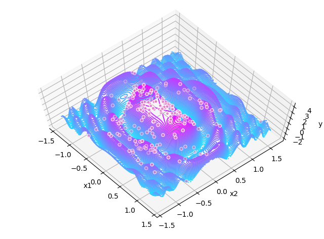
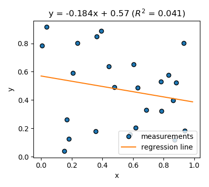
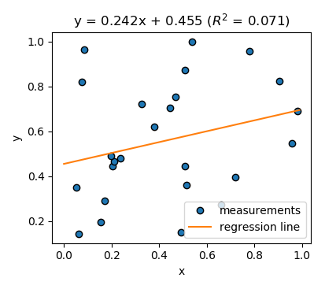

# A Simple and Free Statistics Package
## Andrew Garcia

Welcome to the statistics repository! Some changes have been made to streamline the user experience. Click on the Jupyter presentations below to get a feel of the scripts and how to use them.

## Histogram Distribution Fitting
**Basics**

**Excel importer**

### Python file(s):
* **frame_pdsfit.py**
* **pdsfit.py**
* **pdsfit_more.py**

## Equation Fitting - Local and Global Error Minimization Algorithms

### Python file(s):
* **minfit.py**
* **basinhopfit.py**

## Simple Linear Regression
A simple template for linear fits
- [x] Calculates R^2, p value, and standard error of a linear fitting.
- [x] Example selects data points randomly and performs linear regression thereof:

### Python file(s):
* **linreg.py**

## SPSS to CSV Format Converter
Extract SPSS files (.sav) with python / convert to .csv format

* must install pyreadstat:
> pip install pyreadstat

### Python file(s):
* **spss_convert.py**

Copyright 2019 Andrew Garcia

Licensed under the Apache License, Version 2.0 (the "License");
you may not use this file except in compliance with the License.
You may obtain a copy of the License at

    http://www.apache.org/licenses/LICENSE-2.0

Unless required by applicable law or agreed to in writing, software
distributed under the License is distributed on an "AS IS" BASIS,
WITHOUT WARRANTIES OR CONDITIONS OF ANY KIND, either express or implied.
See the License for the specific language governing permissions and
limitations under the License.
