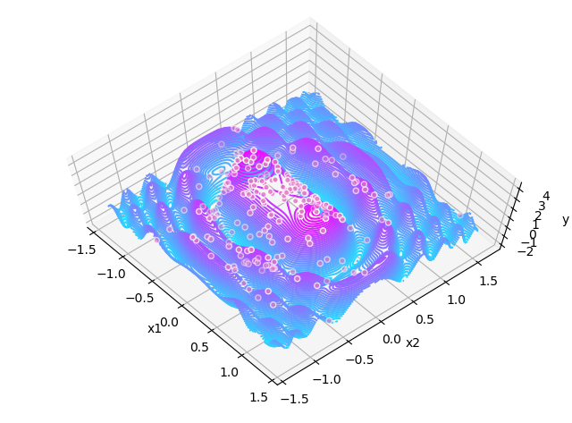
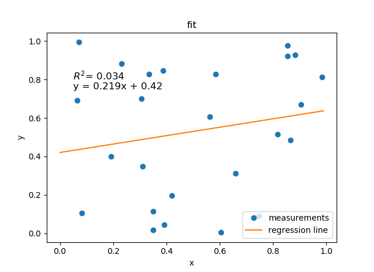
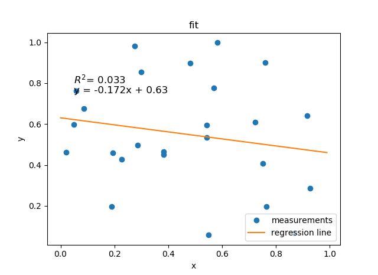

# A Simple and Free Statistics Package
## Andrew Garcia, 2019

Welcome to the statistics repository! Some changes have been made to streamline the user experience. Click on the Jupyter presentations below to get a feel of the scripts and how to use them.

## Histogram Distribution Fitting (New Version In Progress)

## Equation Fitting - Local and Global Error Minimization Algorithms

## spss_convert.py

Extract SPSS files (.sav) with python / convert to .csv format

* must install pyreadstat:
> pip install pyreadstat

## linreg.py
A simple template for linear fits
- [x] Calculates R^2, p value, and standard error of a linear fitting.
- [x] Example selects data points randomly and performs linear regression thereof:

