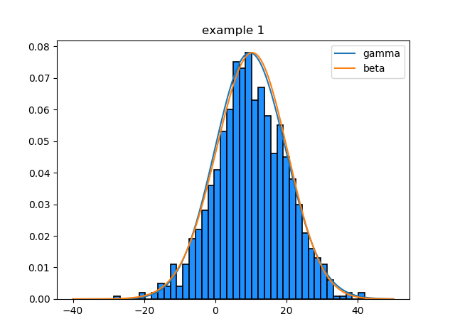
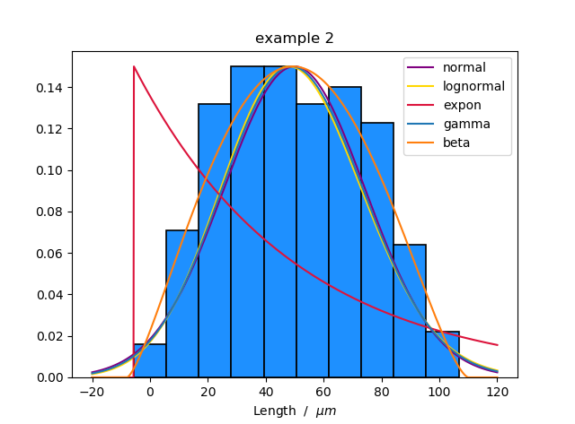
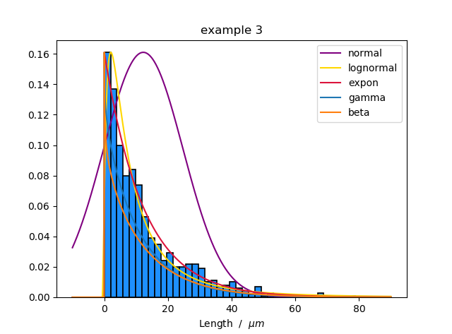
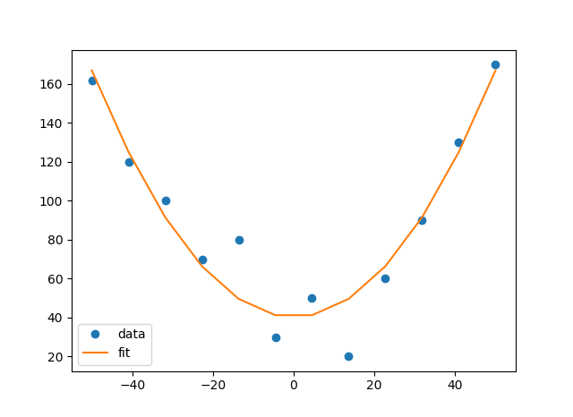

# A user friendly, open sourced statistics & data analysis python package
A statistical analysis python package
Open-source fitting capabilities
#### Andrew Garcia, 2019

##spss_convert.py

Extract SPSS files (.sav) with python / convert to .csv format
must install pyreadstat:
> pip install pyreadstat

## pdsfit.py
Histogram distribution fitting script: Turns raw data to histogram and fits to a selected or series of probability density function(s)
e.g. make(datapoints,'mydata',pds=['gauss','lognormal']) will use the data vector "datapoints" to generate its histogram, and then fit it to a Gaussian and a lognormal distribution. 'mydata' will be displayed as the title to the generated plot.

- [x] Parameters obtained from fitting will be displayed in python shell.
- [x] Currently supports fitting histograms to 5 distribution types:
      *gaussian(normal)
      lognormal
      exponential
      gamma
      beta*

## minfit.py
A nonlinear fitting script (as in those usually performed through Excel)
that performs through an error minimization algorithm.

## linreq.py
A simple template for linear fits
- [x] Calculates R^2, p value, and standard error of a linear fitting.
